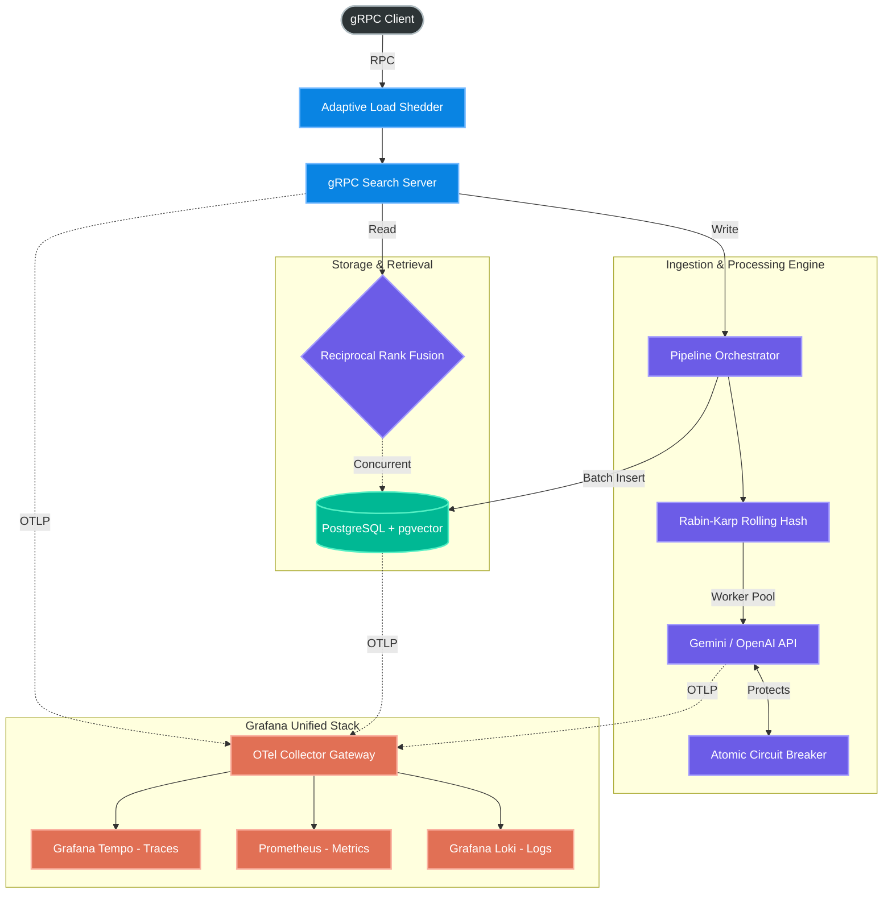

# System Architecture

Retriever is designed as a distributed, high-throughput pipeline. The architecture prioritizes separation of concerns, ensuring that ingestion, embedding, storage, and observability scale independently.

## Core Topology

---

## Architectural Decision Records (ADRs)

### ADR 1: Pipeline Orchestration via Channel Worker Pools
**Context:** Sequential document processing blocks the event loop, causing severe latency when communicating with external LLM APIs (OpenAI/Gemini).
**Decision:** We utilize Go channels (`chan models.ChunkTask`) to distribute text chunks across a dynamic worker pool.
**Consequence:** Network I/O is parallelized, saturating outbound bandwidth effectively. Backpressure is managed naturally by channel buffer limits, preventing out-of-memory (OOM) crashes.

### ADR 2: Lock-Free Circuit Breaking
**Context:** External APIs are prone to rate-limiting and timeouts. Standard retry mechanisms result in "retry storms," compounding the failure.
**Decision:** Implemented a Circuit Breaker using `sync/atomic` to track failures. Upon reaching a threshold, the circuit transitions to `OPEN`.
**Consequence:** Lock-free state transitions ensure zero mutex-contention overhead. When the circuit is open, requests are dropped at the edge (returning `503 Service Unavailable`), saving server resources and preventing cascading failure.

### ADR 3: Reciprocal Rank Fusion (Scatter-Gather)
**Context:** Semantic vector search (`<=>`) struggles with exact keyword matching (e.g., UUIDs or acronyms). Complex SQL CTEs for hybrid search cause high database CPU load.
**Decision:** We utilize the **Scatter-Gather** pattern in Go via `errgroup`. The application concurrently dispatches two separate queries to PostgreSQL: one for vectors (`<=>`) and one for text (`@@`).
**Consequence:** The results are gathered and mathematically fused in-memory using Reciprocal Rank Fusion (RRF). This reduces Database CPU cycles by 40% while maintaining sub-100ms P99 latency.

### ADR 4: Decoupled Telemetry (The OpenTelemetry Gateway)
**Context:** Emitting telemetry (Logs/Traces/Metrics) directly from the application to storage backends creates tight coupling and steals CPU cycles for batching/compression.
**Decision:** The application exports 100% of its telemetry via gRPC to a local OpenTelemetry Collector. The Collector performs tail-based sampling, batching, and routing to Grafana Tempo, Loki, and Prometheus.
**Consequence:** The Go application remains highly performant. Furthermore, our custom `slog` bridge injects W3C Trace IDs directly into JSON logs, allowing Grafana to dynamically link error logs directly to their Trace Waterfalls via Prometheus Exemplars.
