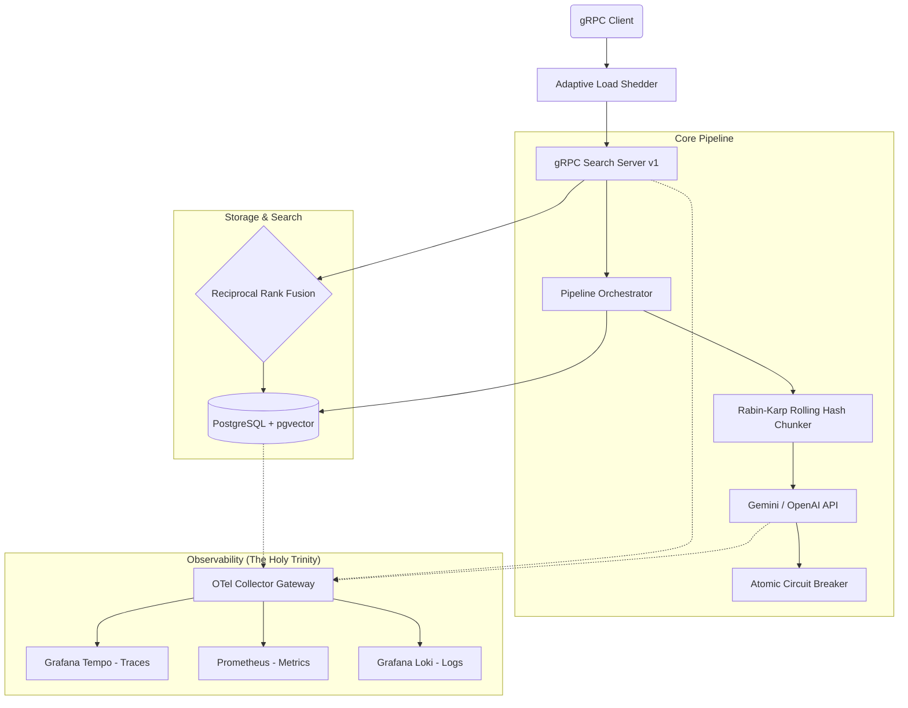

# Retriever v1.0.0 Architecture

Retriever is a production-grade, distributed Retrieval-Augmented Generation (RAG) backend engineered in Go. It moves beyond simple MVP script-kiddie RAG by implementing enterprise resilience, advanced semantic search (Reciprocal Rank Fusion), and a fully decoupled observability stack.

## System Topology

## Key Architectural Decisions (ADRs)

### 1. Ingestion: Channel-Based Worker Pools
Standard RAG frameworks process documents sequentially. Retriever utilizes Go `chan models.ChunkTask` with a configurable number of worker goroutines. This allows us to parallelize API requests to Gemini/OpenAI, maximizing network throughput while respecting external rate limits via our Token Bucket implementation.

### 2. Resilience: Lock-Free Circuit Breaking
When the upstream LLM provider fails (e.g., rate limits or 503s), standard retries cause cascading failures. We implemented a lock-free State Machine using `sync/atomic` (CLOSED → OPEN → HALF-OPEN) that drops traffic before it leaves our infrastructure, returning fast 503s to clients and preventing connection exhaustion.

### 3. Search: Reciprocal Rank Fusion (RRF)
Vector similarity search alone struggles with domain-specific vocabulary (e.g., acronyms). Retriever solves this by using `errgroup.Group` to concurrently execute two queries:
1. `pgvector` Cosine Similarity (`<=>`)
2. `tsvector` Keyword Search (`@@`)
The results are mathematically fused in memory using the RRF algorithm, providing the highest possible relevance scoring.

### 4. Observability: Unified Correlated Stack
Logs, Metrics, and Traces are strictly decoupled from the main application thread.
- **Context Logging Bridge**: A custom `slog.Handler` automatically injects W3C Trace IDs into every JSON log line.
- **Prometheus Exemplars**: Every metric (like `circuit_breaker_drops`) contains an exemplar linking it directly to the exact Trace in Tempo.
- **Semantic Conventions**: We adhere to `go.opentelemetry.io/otel/semconv`, meaning Grafana can automatically generate Service Dependency graphs of our entire infrastructure.
