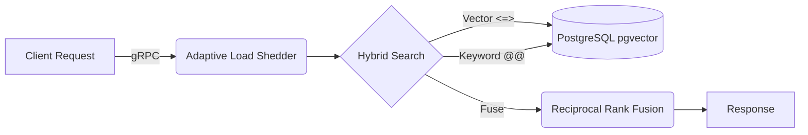

# Retriever 🚀

[](https://pkg.go.dev/github.com/Rebira678/Retriever)
[](https://golang.org/)
[](https://opensource.org/licenses/MIT)

**Retriever** is a high-throughput, fault-tolerant Retrieval-Augmented Generation (RAG) backend engineered in Go. It is designed to handle massive document ingestion and complex vector searches while maintaining strict SLA latencies and unbreakable resilience under load.

## 🎯 Architecture at a Glance

Retriever utilizes a **Scatter-Gather** pattern for search and a **Decoupled Worker Pool** for ingestion, heavily backed by OpenTelemetry for observability.



## 🌟 Key Capabilities

### 1. High-Performance Ingestion Pipeline
* **Concurrent Worker Pools:** Aggressively parallelizes document chunking and LLM embedding using Go channels.
* **Token-Bucket Rate Limiting:** Actively prevents upstream API throttling (OpenAI/Gemini) before requests leave the server.

### 2. Fault Tolerance & Resilience
* **Atomic Circuit Breaker:** Lock-free (`sync/atomic`) state machine (`CLOSED` → `OPEN` → `HALF-OPEN`) that drops traffic at the edge during upstream outages, preventing catastrophic connection exhaustion.
* **Adaptive Load Shedding:** gRPC interceptors that dynamically reject requests based on active concurrent streams, protecting the server from HTTP/2 exhaustion.

### 3. Advanced Hybrid Search (RRF)
* **Scatter-Gather Execution:** Utilizes `errgroup` to simultaneously query `pgvector` for cosine similarity and `tsvector` for keyword relevance.
* **In-Memory Fusion:** Ranks and fuses results at the Go application layer using the Reciprocal Rank Fusion (RRF) algorithm, drastically reducing database CPU load.

### 4. Unified Observability Stack
* **The Holy Trinity:** Traces (Tempo), Metrics (Prometheus), and Logs (Loki) routed through an OpenTelemetry Collector.
* **Log-to-Trace Correlation:** A custom `slog.Handler` automatically injects W3C Trace IDs into JSON logs (1.5µs overhead) for flawless debugging.

---

## ⚡ Quick Start

### 1. Launch the Infrastructure & Observability Stack
Start PostgreSQL (`pgvector`), Grafana, Loki, Tempo, Prometheus, and the OTel Collector:
```bash
docker-compose up -d
```

### 2. Configure Environment
```bash
cp .env.example .env
# Set RETRIEVER_GEMINI_API_KEY or RETRIEVER_OPENAI_API_KEY
```

### 3. Start the Go RAG Backend
The Go backend handles document ingestion, hybrid search, and telemetry export.
```bash
go run ./cmd/retriever
```
*The backend will automatically connect to Postgres on port 5432, exposing a REST API on port 8080 and the primary gRPC server on port 50051.*

### 4. Start the React Frontend
The frontend provides a real-time chat interface with rich observability trace links.
Open a new terminal window:
```bash
cd frontend
npm install
npm run dev
```
Navigate to **http://localhost:5173** in your browser to interact with the RAG pipeline!

### 5. View Telemetry (Grafana)
Every search in the frontend generates a W3C Trace ID. You can click the trace links directly in the chat UI, or manually navigate to **http://localhost:3000** to view the correlated Service Maps, Traces, and Logs.

---

## 📚 Deep Dives

- 🏗 **[System Architecture (ADRs)](ARCHITECTURE.md)**: Detailed breakdown of the pipeline topology and engineering decisions.
- 📊 **[Performance Benchmarks](BENCHMARKS.md)**: CPU, Memory, and Latency profiling results.

## 📜 License
MIT License. See [LICENSE](LICENSE) for details.
